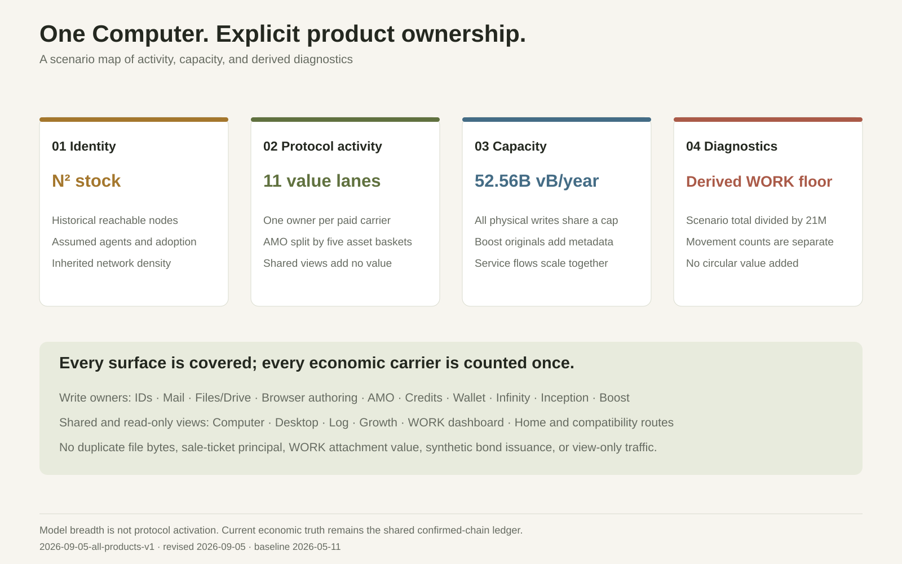
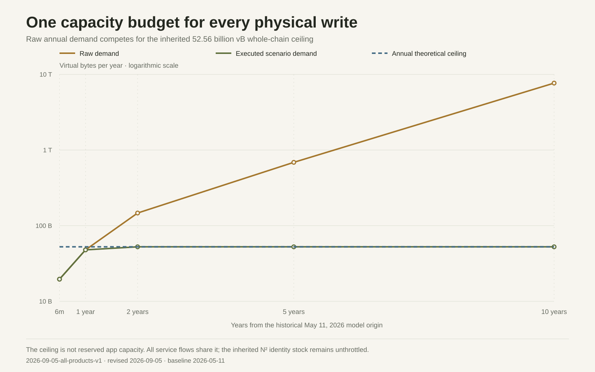
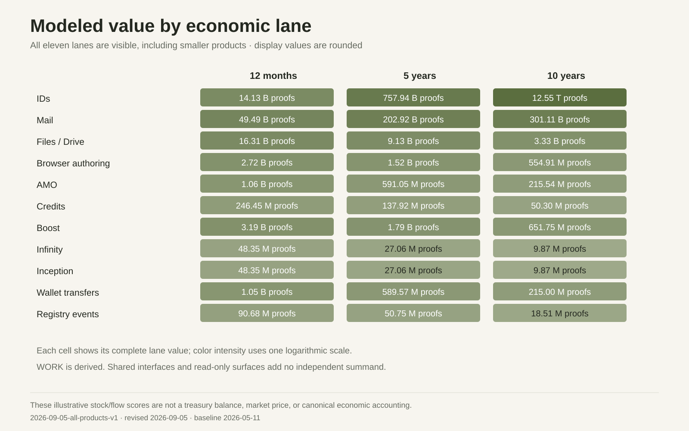
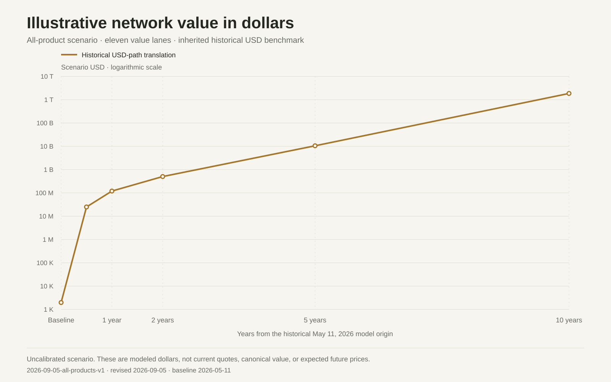
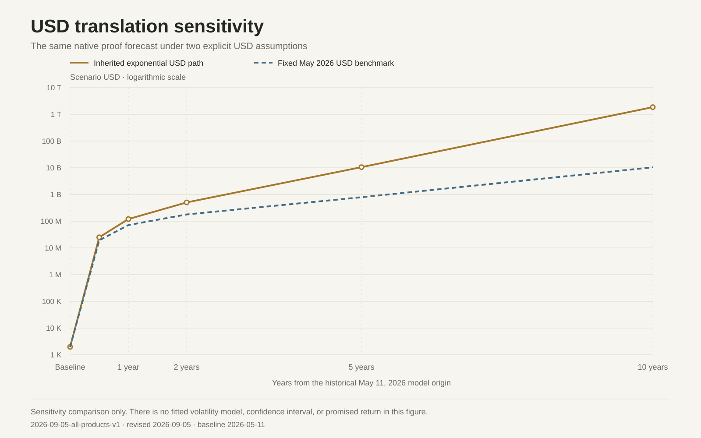

# ProofOfWork Computer growth model

Current scenario: **2026-09-05-all-products-v1**. Revised **2026-09-05**. Historical model origin: **2026-05-11**.

This report models all current product surfaces through eleven economic activity lanes and explicit shared or read-only mappings. It is an uncalibrated scenario extension of historical May inputs. It does not publish a new current-chain measurement or change canonical network value, WORK floors, balances, INCB issuance, or frozen sale-ticket terms.

The [shared model source](../src/features/growth/growthForecast.mjs) drives this report, the main JSON/charts, and Growth's selected all-product forecast. Production actuals remain separate snapshot-bound API data under the [infrastructure contract](../OP_RETURN_INFRASTRUCTURE.md). The complete [May archive](historical/2026-05-13/README.md) preserves its original report, JSON, SVGs, and PNGs byte-for-byte; the [narrow Boost scenario](proofofwork-computer-growth-model-2026-09-05-boost-v1.md) remains reproducible as a separate comparison.

## Read the model



1. Historical reachable-node count, assumed node growth, agent share, and adoption determine scenario IDs.
2. Each economic carrier has one product owner. An interface displaying that carrier does not add its value or bytes again.
3. One annual blockspace ceiling scales all physical writes and service flows. The inherited N² ID stock rule remains unthrottled.
4. A derived WORK scenario floor is a diagnostic of the total, not an additional value component. Canonical live WORK revaluation is deliberately outside this forecast.

Future rows are annual activity rates at their original May-origin horizons, not cumulative confirmed transaction counts or newly rebased September dates. The headline combines an illustrative identity stock with five-times annual service flow, preserving the inherited modeling convention. This is not a cash balance or an estimate of collectible revenue. Fractional transaction counts describe expected scenario rates; displayed values are rounded.

## Product coverage and ownership

Product roles follow the [public surface map](../README.md), [ID rules](../PROOFOFWORK_IDS.md), [AMO settlement rules](../MARKETPLACE.md), and [Mail/Files organization](../MAIL_ORGANIZATION.md). A shared or read-only product remains first-class coverage with zero incremental economic value. Its activity is carried by the listed owner.

| Product | Role | Economic owner / lane | Activity and boundary |
| --- | --- | --- | --- |
| Home | read-only | None / No incremental lane | Landing page and apex redirect. Navigation creates no chain activity. |
| IDs | economic | IDs / Registry events / idSats + computerEventSats | ID stock, registrations, receiver updates, and direct ownership transfers. Identity stock and registry payments are separate components; registration bytes occur once. |
| Computer | aggregate | Underlying activity products / totalSats | Shell, Mail, Files, embedded workspaces, and NFT route alias. Aggregate of owned activity lanes; the shell and NFT alias add no second copy. |
| Mail | economic | Mail / mailSats | Computer workspace for ordinary messages and text-only Boost originals. Files, HTML pages, and tagged bonds are allocated to their specific lane; the ordinary Mail basket excludes those carriers. |
| Files | economic | Files / Drive / driveSats | Computer workspace for non-HTML file publication and retrieval. A published file and its Mail carrier occur once; HTML authoring belongs to Browser and repeat retrieval is read-only. |
| Desktop | shared | Files / Drive or Browser authoring / driveSats / browserSats | Read-only access to existing Files and HTML records. Zero additional value or writes for displaying the same file. |
| Browser | shared | Browser authoring / browserSats | HTML publication through Mail/Files; read-only rendering. Publish once in the Browser authoring basket; Mail/Drive and repeat views do not duplicate it. |
| Boost | economic | Boost with shared Mail/Files / boostSats; original carrier in mailSats | Original posts, paid social actions, and Boost sale lifecycles. Originals add metadata only; paid-action and sale baskets are disjoint; media and WORK are not valued twice. |
| AMO | economic | AMO / Boost / marketplaceSats; Boost sale flow in boostSats | ID, credit, WORK, POWB, INCB, and Boost markets; legacy Marketplace hostname. Each sale/mutation belongs to one asset basket, with seller price and registry fee separated. |
| Credits | economic | Credits / tokenSats | Generic credit creation and minting; token/tokens hostname aliases. Creation and mint assumptions only; ownership transfers and markets belong to their respective baskets. |
| Wallet | economic | Wallet transfers / AMO / walletSats; trades in marketplaceSats | Balances, standalone generic/WORK transfers, and market controls. Balance display is read-only; standalone transfer fees are incremental; trades are counted only in AMO. |
| WORK | derived | Wallet / AMO / aggregate / workMovementWrites + workFloorSats (nonadditive) | WORK movement count and scenario total divided by capped supply. No new WORK mint demand and no separate floor capitalization or endogenous movement revaluation. |
| Infinity | economic | Infinity / AMO / infinitySats; POWB trades in marketplaceSats | Direct bond payments, synthetic issuance, and POWB markets. Bond payment once; synthetic issuance adds no payment; sale/mutation fees occur in AMO. |
| Inception | economic | Inception / AMO / inceptionSats; INCB trades in marketplaceSats | Direct bond payments, synthetic issuance, and INCB markets. Direct payment once; attached WORK and exact INCB issuance feedback are outside the forward-value model. |
| Log | read-only | Underlying activity products / No incremental lane | Confirmed event discovery and transaction evidence. The event's owner counts its flow; viewing or indexing a Log row adds no payment. |
| Growth | read-only | Aggregate / scenario diagnostics / No incremental lane | Confirmed metrics and forward scenarios. A dashboard, metric, or forecast creates no new chain value. |

Mail covers plain-message traffic and original Boost text carriers; file-bearing, HTML-authoring, and bond carriers belong to their exclusive lanes. Files/Drive covers non-HTML files. Browser counts HTML publication carried by Mail/Files, while viewing an existing page creates no write. Infinity and Inception count their own tagged bond carriers. The Computer shell, Desktop, Log, Growth, and shared entry points do not duplicate those carriers.

AMO separates ID, generic-credit, governed WORK, POWB, and INCB sale/cancellation baskets. Boost sale tickets are counted in Boost's own lifecycle basket. Wallet counts standalone transfers, excluding AMO settlement and attached WORK already carried by another action. WORK diagnostics and synthetic bond issuance are nonadditive. These partitions are scenario assumptions; they do not replace validation and output ownership in canonical replay.

## Historical inputs and shared assumptions

| Input | Value | Meaning |
| --- | ---: | --- |
| Historical reachable nodes | 23,984 | May model input; original source snapshot April 30, 2026 |
| Agent-controlled node share | 51% | Assumption |
| Annual node growth | 25% | Assumption |
| Historical confirmed IDs | 94 | May 11 baseline, not current supply |
| Historical Mail flow | 10,202 proofs | Origin input before the service multiple; not annualized current traffic |
| Historical Files flow | 2,184 proofs | Origin input before the service multiple |
| Historical AMO volume | 1,000 proofs | Origin input before the service multiple |
| Historical Browser / Credits / Boost flow | 0 / 0 / 0 proofs | Preserved origin inputs; not a claim of no current activity |
| ID density | 268.68933907 proofs / N² | Historical model density, not a live registry balance |
| Mail edge density | 0.0123076923 | Inherited historical model relationship density |
| May USD benchmark | $80,879.33 | May 11, 2026 historical input |
| Ten-year-old USD benchmark | $452.73 | May 11, 2016 historical input |
| Selected scenario fee | 0.00001 sat/vB | Hypothetical usage multiplier input, not an accepted relay quote |
| Service value multiple | 5× | Scenario convention, not a newly declared economic parameter |
| Annual capacity | 52,560,000,000 vB | Inherited theoretical whole-chain ceiling, not reserved app capacity |

Historical observations and their source notes are retained in the [archived report](historical/2026-05-13/proofofwork-computer-agent-adoption-model.md). No new source survey or September calibration is asserted. New products start with zero additional value at the historical origin because no new historical baseline is invented; that zero says nothing about current usage.

| Horizon from May origin | Years | Assumed adoption |
| --- | ---: | ---: |
| 6 months | 0.5 | 10% |
| 12 months | 1 | 20% |
| 24 months | 2 | 40% |
| 5 years | 5 | 60% |
| 10 years | 10 | 80% |
| 25 years | 25 | 90% |
| 50 years | 50 | 100% |

## Explicit product assumptions

### IDs

- Usage: Projected agent nodes × adoption; ID writes use the original ID fee multiplier.
- Value: N² × 268.68933906745133 proofs density × fee multiplier; registration fees are in Registry events.
- Fee elasticity: 0.25
- Blockspace: 350 vB per registration; physical writes share the common cap.
- Attribution: ID network stock is unthrottled. Registration transaction bytes are counted here once; the same registration is not a second Registry-event write.

### Mail

- Usage: 4 messages per directed pair per year × 0.012307692307692308 edge density.
- Value: 680.1333333333333 proofs per delivery × 5 service multiple.
- Fee elasticity: 0.5
- Blockspace: 500 vB per ordinary message.
- Attribution: Ordinary text messages, including text-only Boost originals; excludes file, HTML-page, and bond publications.

### Files / Drive

- Usage: 6 non-HTML files per ID per year.
- Value: 1000 proofs per file × 5 service multiple.
- Fee elasticity: 0.75
- Blockspace: 9621 vB per publication, including its Mail carrier.
- Attribution: Files and Desktop expose the same record; neither Mail nor Desktop adds its payment or bytes again. Boost media reuses these published files.

### Browser authoring

- Usage: 1 HTML pages per ID per year.
- Value: 1000 proofs per page × 5 service multiple.
- Fee elasticity: 0.75
- Blockspace: 15000 vB per HTML publication. Reading adds zero bytes.
- Attribution: HTML Mail bodies and HTML Files attachments are allocated exclusively here; Mail/Drive do not add the same page again.

### Boost

- Usage: 4 text originals, 12 standalone paid actions, and 0.02 sales per ID per year. Originals are capped by Mail demand.
- Value: 546 registry proofs per paid action; each sale adds 1000 seller proofs plus 3 registry fees, then × 5.
- Fee elasticity: 0.5
- Blockspace: 250 additional metadata vB per original; 500 vB per paid action; 1500 vB per sale lifecycle.
- Attribution: Original transactions stay in Mail; media stays in Files; WORK attachments have no added forecast value. Boost sales are excluded from the non-Boost AMO basket.

### Infinity / POWB

- Usage: 0.1 direct bond actions per ID per year.
- Value: 1000 direct proofs per bond × 5 service multiple.
- Fee elasticity: 0.5
- Blockspace: 500 vB per tagged bond transaction, including its Mail carrier.
- Attribution: Direct bond payment counted once; synthetic issuance adds no second payment. Bond trades belong to AMO, and attached WORK is outside this value forecast.

### Inception / INCB

- Usage: 0.1 direct bond actions per ID per year.
- Value: 1000 direct proofs per bond × 5 service multiple.
- Fee elasticity: 0.5
- Blockspace: 500 vB per tagged bond transaction, including its Mail carrier.
- Attribution: Direct bond payment counted once; synthetic issuance adds no second payment. Bond trades belong to AMO, and attached WORK is outside this value forecast.

### Credits

- Usage: 0.01 generic credit creations and 0.25 generic credit mints per ID per year.
- Value: 546 proofs per creation and 1000 proofs per mint, then × 5.
- Fee elasticity: 0.6
- Blockspace: 700 vB per creation; 700 vB per mint.
- Attribution: Creation/mint only. Transfers belong to Wallet; trades to AMO; no new WORK or bond issuance is assumed here.

### Wallet transfers

- Usage: 1 generic-credit and 1 WORK standalone transfers per ID per year.
- Value: 546 registry proofs per transfer × 5 service multiple.
- Fee elasticity: 0.6
- Blockspace: 700 vB per standalone transfer.
- Attribution: Market purchases and attached transfers are excluded from this standalone basket. WORK quantity revaluation is not added to the total.

### AMO

- Usage: IDs: 0.2 sales / 0.05 canceled listings per ID per year; Generic credits: 0.05 sales / 0.01 canceled listings per ID per year; WORK: 0.05 sales / 0.01 canceled listings per ID per year; POWB: 0.02 sales / 0.005 canceled listings per ID per year; INCB: 0.02 sales / 0.005 canceled listings per ID per year
- Value: Seller-price assumptions: IDs 1000 proofs, Generic credits 1000 proofs, WORK 25000 proofs, POWB 1000 proofs, INCB 1000 proofs. Each lifecycle write adds 546 registry proofs; combined flow × 5.
- Fee elasticity: 0.5
- Blockspace: 500 vB per write; completed sales use 3 writes (list/seal/buy), cancellations 2 (list/delist).
- Attribution: Separate IDs/generic-credit/WORK/POWB/INCB baskets; excludes Boost sales, Wallet standalone transfers, ticket refunds, and guessed WORK settlement quantities.

### Registry events

- Usage: ID registration writes already modeled under IDs, plus 0.1 nonmarket receiver/direct-transfer mutations per ID per year.
- Value: 1000 registry proofs per registration and 546 per mutation, then × 5.
- Fee elasticity: Registrations 0.25; mutations 0.25.
- Blockspace: 350 vB per additional mutation; registration bytes remain only in IDs.
- Attribution: Known nonmarket ID registry flow only. No generic fee is assigned to Log itself, and AMO mutations remain in AMO.

### WORK diagnostic

- Usage: Standalone WORK transfers from Wallet plus WORK sale movements from AMO, referenced once.
- Value: Scenario total / 21000000 WORK; diagnostic only, no added capitalization or endogenous movement value.
- Fee elasticity: Inherited from Wallet and AMO; no additional multiplier.
- Blockspace: Zero additional writes or bytes; movements are already in Wallet/AMO.
- Attribution: Endpoint scenario floor only. It does not simulate canonical Q16 replay, historical frozen terms, movement feedback, or settlement prices.

The 1,000-proof ID registration and 546-proof mutation rules are documented in [ProofOfWork IDs](../PROOFOFWORK_IDS.md). AMO fees, sale-ticket principal, and frozen WORK terms follow [Marketplace](../MARKETPLACE.md). The WORK 25,000-proof seller face is a protocol input; deriving a listing's exact WORK amount remains canonical replay, not a forecast operation. Bond quantities or WORK attachments create no second scenario payment lane.

Boost assumptions remain explicit and uncalibrated. Original posts add metadata to existing Mail demand. Standalone paid actions exclude sale-ticket lifecycle writes. Its scenario adds only stated registry and seller flow; optional proof signal, follow-recipient payments, WORK movement, media, miner fees, and ticket principal are excluded. A separate canonical Boost contribution remains an [unactivated proposal](../BOOST_GROWTH_ACCOUNTING_PROPOSAL.md).

## Formula and capacity

```text
nodes(t) = historical_nodes × (1 + node_CAGR)^t
IDs(t) = nodes(t) × assumed_agent_share × horizon_adoption
fee_multiplier(product) = (0.01 / scenario_fee_rate)^product_elasticity
ID_stock = IDs² × historical_ID_density × ID_fee_multiplier
raw_service_value = attributed_annual_proof_flow × service_value_multiple
raw_bytes = sum(exclusive_physical_writes × assumed_vbytes) + Boost_original_metadata
capacity_ratio = raw_bytes > 0 ? min(raw_bytes, annual_capacity) / raw_bytes : 1
executed_writes = raw_writes × capacity_ratio
scenario_total = ID_stock + sum(raw_service_value × capacity_ratio)
derived_WORK_floor = scenario_total / 21000000
```

AMO sale lifecycles include list, seal, and buy; canceled lifecycles include list and delist. Sale volume is the seller price, while fees are separate registry payments. Ticket creation, ticket refunds, change, and unrelated outputs are not added. The shared model source specifies the exact arithmetic and per-asset basket rates. Its floating-point, 12-significant-digit artifact serialization is for scenarios only; canonical proof amounts, Q8 value, and Q16 WORK remain exact integer protocol data.



| Horizon | Raw demand (vB/year) | Executed (vB/year) | Demand fulfilled | Physical writes/year |
| --- | ---: | ---: | ---: | ---: |
| 6 months | 19,614,337,667 | 19,614,337,667 | 100.0000% | 5,396,491 |
| 12 months | 47,882,710,764 | 47,882,710,764 | 100.0000% | 20,114,358 |
| 24 months | 147,002,933,084 | 52,560,000,000 | 35.7544% | 37,498,562 |
| 5 years | 687,865,289,145 | 52,560,000,000 | 7.6410% | 62,782,198 |
| 10 years | 7,675,114,118,440 | 52,560,000,000 | 0.6848% | 89,680,414 |
| 25 years | 6,648,302,456,350,000 | 52,560,000,000 | 0.0008% | 104,550,082 |
| 50 years | 571,742,075,696,000,000,000 | 52,560,000,000 | 0.0000% | 105,118,051 |

The capacity ceiling is a hypothetical allocation of the entire inherited theoretical chain budget. It does not establish available relay policy, economic demand, app market share, or future protocol capacity. When demand exceeds capacity, new product traffic displaces some execution in every shared service lane; ID stock is still governed by the inherited N² assumption.

## Forecast by economic lane



| Lane (proofs) | 12 months | 5 years | 10 years |
| --- | ---: | ---: | ---: |
| IDs | 14,129,084,927 | 757,943,179,259 | 12,549,148,322,100 |
| Mail | 49,490,545,697 | 202,917,485,008 | 301,113,518,097 |
| Files / Drive | 16,313,721,914 | 9,129,906,366 | 3,329,459,055 |
| Browser authoring | 2,718,953,652 | 1,521,651,061 | 554,909,842 |
| AMO | 1,056,112,332 | 591,048,858 | 215,541,419 |
| Credits | 246,447,668 | 137,923,408 | 50,297,377 |
| Boost | 3,193,440,624 | 1,787,195,714 | 651,747,643 |
| Infinity | 48,350,593 | 27,059,208 | 9,867,847 |
| Inception | 48,350,593 | 27,059,208 | 9,867,847 |
| Wallet transfers | 1,053,475,507 | 589,573,170 | 215,003,271 |
| Registry events | 90,675,419 | 50,746,120 | 18,505,899 |
| Total | 88,389,158,927 | 974,722,827,379 | 12,855,317,040,400 |

All seven horizon rows and every lane are in the [current JSON](proofofwork-computer-growth-model.json). Shared and read-only surfaces have no independent summand. WORK movement counts and the scenario floor below are diagnostic outputs and must not be added to the total.

| Horizon | IDs | Total (proofs) | Derived WORK floor (proofs/WORK) | WORK movement writes/year |
| --- | ---: | ---: | ---: | ---: |
| 6 months | 1,368 | 23,797,193,680 | 1,133.199699 | 88,450 |
| 12 months | 3,058 | 88,389,158,927 | 4,209.007568 | 197,779 |
| 24 months | 7,645 | 221,062,983,778 | 10,526.808751 | 176,787 |
| 5 years | 22,397 | 974,722,827,379 | 46,415.372732 | 110,686 |
| 10 years | 91,134 | 12,855,317,040,400 | 612,157.954306 | 40,365 |
| 25 years | 2,913,967 | 12,830,149,710,800,000 | 610,959,510.037000 | 1,490 |
| 50 years | 857,022,930 | 1,109,775,976,120,000,000,000 | 52,846,475,053,200.000000 | 5 |

## AMO baskets

The following are annual scenario rates at the 12-month May-origin horizon, after the common capacity allocation. They are not current book inventory. Listings include both completed-sale and canceled-listing baskets; seal counts belong to sale lifecycles.

| Asset | Sales | Canceled listings | Registry writes | Seller flow (proofs) | Registry fees (proofs) |
| --- | ---: | ---: | ---: | ---: | ---: |
| ids | 19,340.24 | 4,835.06 | 67,690.83 | 19,340,237 | 36,959,193 |
| credits | 4,835.06 | 967.01 | 16,439.20 | 4,835,059 | 8,975,804 |
| work | 4,835.06 | 967.01 | 16,439.20 | 120,876,482 | 8,975,804 |
| powb | 1,934.02 | 483.51 | 6,769.08 | 1,934,024 | 3,695,919 |
| incb | 1,934.02 | 483.51 | 6,769.08 | 1,934,024 | 3,695,919 |

Boost marketplace activity remains its separately modeled basket. This avoids treating its sales as both AMO and Boost value.

## USD translation and fee sensitivity



The inherited USD path uses `mu = ln(May_2026_USD / May_2016_USD) / 10`, then `USD_benchmark(t) = May_2026_USD × exp(mu × t)`. Scenario dollars equal native proofs divided by 100,000,000 and multiplied by that benchmark. This extrapolates historical growth; it is not a live quote or an expected future price. Growth's current-dollar UI uses the separate live first-party quote, so its live-dollar translation need not equal this static table.

| Horizon | Inherited USD benchmark | Scenario value (USD) |
| --- | ---: | ---: |
| 6 months | $104,818.38 | $24,943,833.77 |
| 12 months | $135,843.03 | $120,070,515.00 |
| 24 months | $228,158.79 | $504,374,622.16 |
| 5 years | $1,081,027.35 | $10,537,020,319.80 |
| 10 years | $14,448,934.29 | $1,857,456,311,980.00 |
| 25 years | $34,501,122,303.60 | $4,426,545,643,450,000,000.00 |
| 50 years | $14,717,325,677,700,000.00 | $163,329,344,698,000,000,000,000,000,000.00 |



The compatibility filename `volatility` now contains a translation sensitivity comparison: the same native scenario at a fixed May benchmark versus the inherited exponential benchmark. It is not a statistical confidence interval, fitted volatility estimate, or promised return. The original volatility-cone figure remains unchanged in the historical archive.

| Scenario fee (sat/vB) | 12m total (proofs) | 5y total (proofs) | 10y total (proofs) |
| --- | ---: | ---: | ---: |
| 0.01000 | 4,358,770,792 | 220,821,400,960 | 2,578,477,908,590 |
| 0.00100 | 10,564,248,686 | 513,647,878,541 | 4,307,590,308,950 |
| 0.00010 | 28,732,117,266 | 686,326,022,484 | 7,383,345,791,470 |
| 0.00001 | 88,389,158,927 | 974,722,827,379 | 12,855,317,040,400 |

## Scope limits

- The May 11, 2026 baseline, node sample, adoption horizons, and historical modeled USD path are retained. New scenario assumptions are not current chain calibration.
- All-product coverage maps every public app to its economic owner or shared/read-only role. It is not an exact canonical replay or a forecast of every possible action variant.
- Mail means ordinary text messages, including text-only Boost originals, excluding file, HTML-page, and bond publications. Non-HTML files belong to Drive; HTML publication belongs exclusively to Browser authoring, whether carried as a Mail body or Files attachment. Reading the same record adds no transaction or value.
- Boost originals reuse Mail transactions and existing Files media; only their additional Boost metadata consumes extra bytes. Standalone paid actions and Boost sale lifecycles are separate baskets. Optional recipient/follow signal, WORK attachments, profile/hide actions, and incomplete/cancelled Boost listings are outside the incremental Boost scenario.
- Infinity and Inception count direct tagged-bond payments and their own transaction bytes. Synthetic POWB/INCB issuance is not another payment. Their sale and mutation flows belong only to AMO. Attached WORK and INCB issuance from it require exact replay and are not valued again here.
- Generic credit creation/minting belongs to Credits; standalone generic and WORK transfer fees belong to Wallet; trade payments and market mutations belong to AMO. WORK is not assigned new credit creation or mint demand.
- ID stock retains the original N-squared rule. Registration fees and nonmarket receiver/direct-transfer mutation fees belong to Registry events; registration transaction bytes are counted only in the ID-write lane.
- The WORK diagnostic shows standalone WORK transfers plus AMO WORK sales and divides the scenario total by 21,000,000. It adds no value or writes. It omits endogenous live WORK revaluation, frozen confirmation ordering, exact Q16 quantities, and the resulting feedback on AMO/INCB; it is not the canonical live floor or a settlement quote.
- The non-Boost AMO basket models complete list/seal/buy and list/delist lifecycles. WORK uses the current 25,000-proof face; no frozen WORK amount is guessed. Other seller prices are assumptions. Ticket principal/refunds, miner fees, open inventory, and failed attempts are excluded from scenario value.
- Floating-point scenario counts and values are display estimates. Canonical balances, fees, issuance, sale terms, and WORK floors remain exact chain-derived arithmetic outside this model.

## Reproduce and inspect

Run `node scripts/generate-growth-forecast.mjs` from the repository root to regenerate the current main report, JSON, and five deterministic SVG charts, plus the narrower Boost-v1 report/JSON. Run `node scripts/generate-proofofwork-computer-model.mjs` to reproduce the seven deterministic May outputs in the archive. `SHA256SUMS` preserves the original bytes of all twelve archived artifacts, including the five original PNGs.

SVG is the canonical chart format linked above. Run `node scripts/render-growth-charts.mjs` with the installed Playwright/Chrome runtime to refresh root PNG companions for convenient sharing. PNGs are renderer-dependent companions; they do not replace the deterministic SVG/source checks. All reported numbers come from the shared module, and this generator rejects missing lanes or a lane/total mismatch.

Source authority remains explicit: [product roles](../README.md), [IDs and fees](../PROOFOFWORK_IDS.md), [sale-ticket and WORK rules](../MARKETPLACE.md), [Mail/Files sharing](../MAIL_ORGANIZATION.md), [snapshot/API behavior](../OP_RETURN_INFRASTRUCTURE.md), and the [draft Boost accounting design](../BOOST_GROWTH_ACCOUNTING_PROPOSAL.md). None of these static artifacts asserts a production deployment or replaces confirmed-chain verification.
